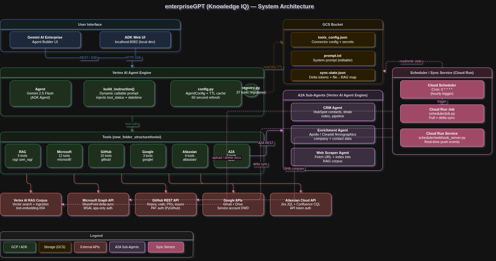

# enterpriseGPT — System Design Document

## 1. Overview

enterpriseGPT (Knowledge IQ) is a multi-source Retrieval-Augmented Generation (RAG) agent built on Google's Agent Development Kit (ADK) and deployed to Vertex AI Agent Engine. It provides a single conversational interface for querying across enterprise data sources — SharePoint, GitHub, Gmail, Google Drive, Jira, Confluence — combined with a Vertex AI RAG vector corpus for indexed document search.

All connectors are togglable at runtime through a GCS-backed config file without redeployment.

---

## 2. Architecture

### System Architecture Diagram



> Source file (editable): [architecture.drawio](architecture.drawio) — open in [app.diagrams.net](https://app.diagrams.net/) or VS Code with the Draw.io Integration extension.

---

### Architecture Overview (ASCII)

```
┌──────────────────────────────────────────────────────────────────────┐
│                       Gemini AI Enterprise                            │
│                  (Front-end — Agent Builder UI)                       │
└────────────────────────────┬─────────────────────────────────────────┘
                             │ REST / gRPC
┌────────────────────────────▼─────────────────────────────────────────┐
│                   Vertex AI Agent Engine                              │
│                 (Cloud-managed ADK runtime)                           │
│                                                                       │
│  ┌──────────────────────────────────────────────────────────────┐    │
│  │  Agent  (Gemini 2.5 Flash)                                   │    │
│  │  ├─ Dynamic prompt  ←── GCS: prompt.txt                      │    │
│  │  ├─ Dynamic config  ←── GCS: tools_config.json (TTL 60s)    │    │
│  │  └─ 37 registered tools                                      │    │
│  └──────────────────────────────────────────────────────────────┘    │
│                                                                       │
│  Tool categories:                                                     │
│  ├─ RAG (5 tools)          ── Vertex AI RAG corpus                   │
│  ├─ Google (3 tools)       ── Gmail, Drive, Gemini Enterprise        │
│  ├─ GitHub (8 tools)       ── Repos, commits, PRs, issues, code      │
│  ├─ Atlassian (4 tools)    ── Jira, Confluence                       │
│  ├─ Microsoft (9 tools)    ── SharePoint sites, drives, files, lists │
│  └─ A2A (3 tools)          ── CRM Agent, Enrichment Agent, Scraper   │
└──────────────────────────────────────────────────────────────────────┘
                             │
           ┌─────────────────┼─────────────────┐
           ▼                 ▼                 ▼
    ┌─────────────┐  ┌─────────────┐  ┌──────────────┐
    │  Vertex AI  │  │ Cloud Run   │  │   GCS Bucket │
    │  RAG Corpus │  │ Sync Service│  │  (config,    │
    │  (vector DB)│  │(job+webhook)│  │   prompts,   │
    └─────────────┘  └─────────────┘  │   state)     │
                             │        └──────────────┘
              ┌──────────────┴──────────────┐
              ▼                             ▼
       ┌──────────────┐            ┌───────────────┐
       │  SharePoint  │            │    GitHub     │
       │ (Graph Delta)│            │ (HEAD SHA)    │
       └──────────────┘            └───────────────┘
```

---

## 3. Component Breakdown

### 3.1 Agent Core (`enterpriseGPT/`)

| File | Role |
|---|---|
| `agent.py` | ADK `Agent` definition — registers tools, binds dynamic instruction |
| `config.py` | TTL-cached config loader — reads `tools_config.json` from GCS every 60s |
| `prompts.py` | Callable instruction — injects tool status + UTC time on every invocation |
| `agent_engine_app.py` | Vertex AI deployment wrapper (`AdkApp`) |

### 3.2 Tools (`tools/`)

All 37 tools are **always registered** at startup. Each tool re-reads config on every call, so enabling/disabling a connector in `tools_config.json` takes effect within 60 seconds without restart.

| Category | Tools |
|---|---|
| `rag/` | `search_knowledge_base`, `upload_attachment`, `upload_document`, `list_my_documents`, `delete_my_document` |
| `google/` | `search_gmail`, `get_gmail_message`, `search_gemini_connectors` |
| `github/` | `list_github_repos`, `get_github_repository`, `list_github_commits`, `get_github_commit`, `list_github_pull_requests`, `get_github_pull_request`, `search_github_issues`, `get_github_issue`, `search_github_code`, `get_github_file_content` |
| `atlassian/` | `search_jira`, `get_jira_issue`, `search_confluence`, `get_confluence_page` |
| `microsoft/` | `list_sharepoint_sites`, `get_sharepoint_site`, `list_sharepoint_drives`, `list_sharepoint_drive_items`, `search_sharepoint_files`, `get_sharepoint_file_content`, `get_sharepoint_file_metadata`, `list_sharepoint_lists`, `get_sharepoint_list_items`, `search_sharepoint`, `list_sharepoint_pages`, `get_sharepoint_page` |
| `a2a/` | `call_crm_agent`, `call_enrichment_agent`, `call_web_scraper_agent` |

### 3.3 Scheduler / Sync Service (`scheduler/`)

A separate Cloud Run deployment (not part of the agent runtime) that keeps the Vertex AI RAG corpus up-to-date.

| Component | Description |
|---|---|
| `job.py` | Cloud Run Job — runs on cron schedule, full/delta sync |
| `webhook_server.py` | Cloud Run Service — FastAPI webhook receiver for real-time push events |
| `connectors/sharepoint.py` | Microsoft Graph Delta API — incremental sync with delta tokens per drive |
| `connectors/github.py` | GitHub compare API — incremental sync using HEAD SHA per repo |
| `ingestion.py` | Vertex AI RAG upload/delete with metadata enrichment |
| `keyword_extractor.py` | Gemini Flash — extracts `doc_type`, `topic`, `keywords` from first 2KB |
| `state.py` | GCS-backed JSON state — persists delta tokens and file→RAG mappings |

---

## 4. Key Design Decisions

### 4.1 Dynamic Config (No Restart Required)
`config.py` fetches `tools_config.json` from GCS and caches it for 60 seconds. This means operators can enable/disable any connector or update credentials at runtime — no redeployment needed.

Secrets in config are resolved via `env:VAR_NAME` — the value is read from the Agent Engine's environment variable at runtime, never stored in GCS.

### 4.2 All Tools Always Registered
The ADK agent registers all 37 tools at startup rather than dynamically adding/removing them. Each tool checks its enabled flag on every call and returns an "DISABLED" response if off. This avoids gRPC serialization issues that can occur with dynamic tool lists.

### 4.3 Per-User File Isolation (RAG)
The `user_rag_tool` uses `stratova_shared.user_file_registry` (a GCS-backed JSON map) to track which RAG files belong to which user. Users can only see, delete, or modify their own uploaded files. Admin mode bypasses this filter.

### 4.4 Incremental Sync Strategy
- **SharePoint**: Microsoft Graph Delta API stores a `deltaLink` per drive. Only changed items are processed on each sync run.
- **GitHub**: Stores the HEAD commit SHA per repo. Uses `repo.compare(last_sha, current_sha)` to get only changed files.
- Both strategies mean the first run is a full crawl; subsequent runs process only deltas.

### 4.5 Agent-to-Agent (A2A) Routing
The `a2a_tools` delegate to independently deployed Vertex AI Agent Engine agents (CRM, Enrichment, Web Scraper) via REST stream_query. Retries are built in to handle cold-start latency (~10s on first call).

---

## 5. Data Flow

### Query Flow (User → Agent → Tool → Response)
```
User message
    → Agent receives (via Gemini AI Enterprise or ADK web UI)
    → build_instruction() called → fetches prompt.txt from GCS + injects tool status
    → Gemini 2.5 Flash reasons over message + tools list
    → Tool called (e.g. search_knowledge_base)
        → get_config() called → reads tools_config.json from GCS (or 60s cache)
        → Vertex AI RAG API queried
        → Results returned to model
    → Model generates final response
    → Response returned to user
```

### Sync Flow (Background → RAG Corpus)
```
Cloud Scheduler (cron: 0 * * * *)
    → Cloud Run Job (scheduler/job.py)
        → Reads sync state from GCS
        → SharePoint connector: GET {deltaLink} → download changed files
        → GitHub connector: compare(last_sha, head_sha) → download changed files
        → keyword_extractor: Gemini Flash extracts metadata
        → ingestion: upload to Vertex AI RAG with metadata
        → Save updated state (new delta tokens, file mappings) to GCS

SharePoint Graph webhook → Cloud Run Service (scheduler/webhook_server.py)
    → Validates clientState
    → Triggers immediate delta sync for affected drive
```

---

## 6. Security Considerations

| Concern | Mitigation |
|---|---|
| API credentials in config | All secrets use `env:VAR_NAME` — stored in Agent Engine env, never in GCS |
| SharePoint access | App registration with Application permissions (read-only: `Sites.Read.All`, `Files.Read.All`) |
| GitHub access | PAT with `repo` (read) + `read:org` scopes only |
| Per-user data isolation | GCS-backed user file registry; each user can only access their own RAG files |
| Webhook validation | SharePoint: `clientState` header check; GitHub: HMAC-SHA256 signature verification |
| Service account | Vertex AI Agent Engine runs under a dedicated service account with least-privilege IAM |

---

## 7. Folder Structure (new_folder_structure layout)

```
new_folder_structure/
├── agents/knowledge-iq/enterpriseGPT/
│   ├── agent.py, config.py, prompts.py    ← agent core (no package wrapper)
│   ├── config/                            ← GCS-backed runtime config files
│   ├── deploy/                            ← deployment scripts + setup utilities
│   ├── scheduler/                         ← sync service (Cloud Run Job + Webhook)
│   ├── agent-card/                        ← Gemini Enterprise agent metadata
│   ├── docs/                              ← this document and others
│   ├── evaluation/demo-documents/         ← test data for RAG seeding
│   └── memory/                            ← project notes
├── tools/                                 ← all tool modules (categorised by vendor)
│   ├── rag/, google/, github/
│   ├── atlassian/, microsoft/, a2a/
│   └── utils/                             ← shared utilities (gcs_utils)
└── deployment/
    ├── deploy_agent.sh                    ← single entry point: full agent deploy
    └── deploy_cloudrun.sh                 ← Cloud Run services + scheduler
```
